# Van der Pol Oscillator: Numerical Methods Comparison
|Van der Pol Oscillator                                   |Comparison of Explicit Methods                            |
|---------------------------------------------------------|----------------------------------------------------------|
|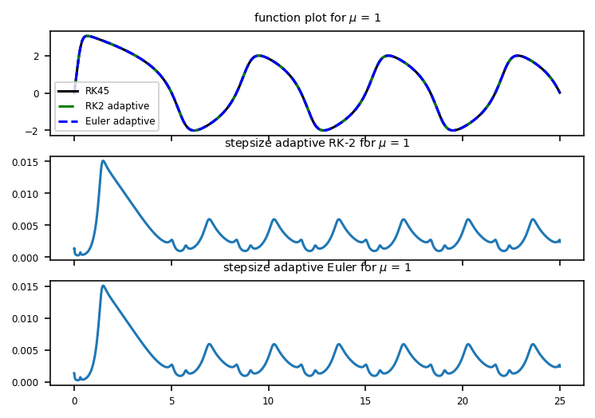 |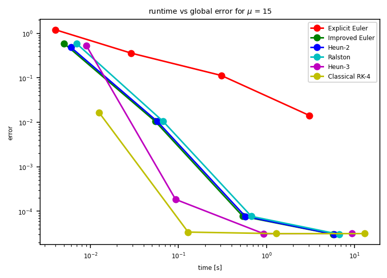 |

This project compares the performance of various numerical methods for solving the Van der Pol oscillator, a non-linear second-order differential equation that models certain oscillatory systems with non-linear damping.

## Equation
The Van der Pol equation is given by:

$\ y'' - \mu (1 - y^2) y' + y = 0 \$

where:
- $y$ is the position coordinate
- $\mu$ is a scalar parameter indicating the nonlinearity and strength of damping
- Initial conditions: $\ y(0) = 0 \$, $\ y'(0) = 8 \$
- Time domain: $\ t \in [0, 25] \$

## Numerical Methods Compared

### Adaptive Step-Size Methods
1. **RK2 adaptive** (2-Step Runge-Kutta 2nd order with adaptive/embedded step size)
2. **Euler adaptive** (Improved Euler with adaptive step size)

### Constant Step-Size Methods
1. **Explicit Euler**
2. **Improved Euler**
3. **Heun-2**
4. **Ralston**
5. **Heun-3**
6. **Classical RK-4**

## Results Summary

| Method            | μ=0.01 (Time) | μ=0.01 (Error) |μ=0.01 (N/tol)   | μ=1 (Time) | μ=1 (Error) |μ=1 (N/tol)      | μ=15 (Time) | μ=15 (Error) |μ=15 (N/tol)     |
|-------------------|---------------|----------------|-----------------|------------|-------------|-----------------|-------------|--------------|-----------------|
| RK-2 adaptive     | 35.53s        | 1.15e-6        |1e-7 (tolerance) | 22.80s     | 4.99e-7     |1e-7 (tolerance) | 1.09s       | 2.94e-5      |1e-6 (tolerance) |
| Euler adaptive    | 35.77s        | 1.15e-6        |1e-7 (tolerance) | 23.06s     | 4.59e-8     |1e-7 (tolerance) | 11.73s      | 3.33e-5      |1e-7 (tolerance) |
| Explicit Euler    | 29.87s        | 6.67e-5        |1e7 (steps count)| 29.11s     | 1.31e-4     |1e7 (steps count)| 28.68s      | 1.48e-3      |1e7 (steps count)|
| Improved Euler    | 5.35s         | 6.48e-7        |1e6 (steps count)| 5.42s      | 4.05e-7     |1e6 (steps count)| 5.27s       | 3.03e-5      |1e6 (steps count)|
| Heun-2            | 5.69s         | 6.48e-7        |1e6 (steps count)| 5.64s      | 4.05e-7     |1e6 (steps count)| 5.58s       | 3.03e-5      |1e6 (steps count)|
| Ralston           | 6.72s         | 6.48e-7        |1e6 (steps count)| 6.51s      | 4.05e-7     |1e6 (steps count)| 6.53s       | 3.03e-5      |1e6 (steps count)|
| Heun-3            | 0.09s         | 6.40e-7        |1e4 (steps count)| 0.91s      | 3.87e-7     |1e5 (steps count)| 0.89s       | 3.12e-5      |1e5 (steps count)|
| Classical RK-4    | 0.01s         | 4.47e-7        |1e3 (steps count)| 0.13s      | 3.85e-7     |1e4 (steps count)| 0.13s       | 3.40e-5      |1e4 (steps count)|

## Key Findings

### μ = 0.01 (Mild Nonlinearity)
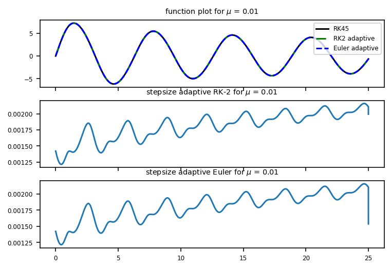
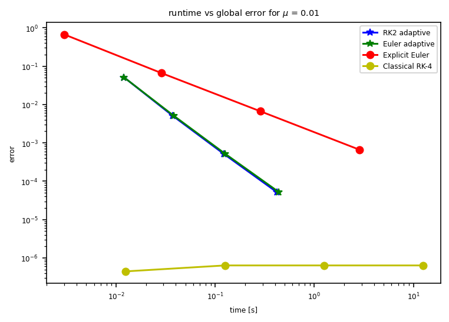
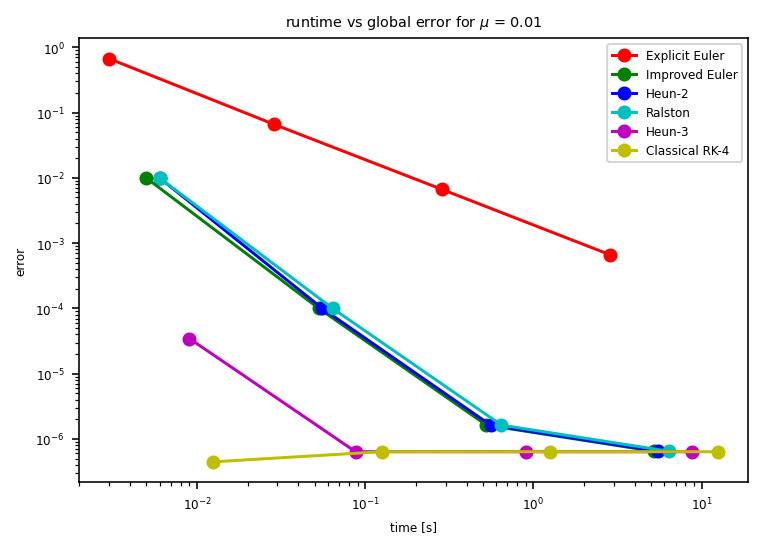
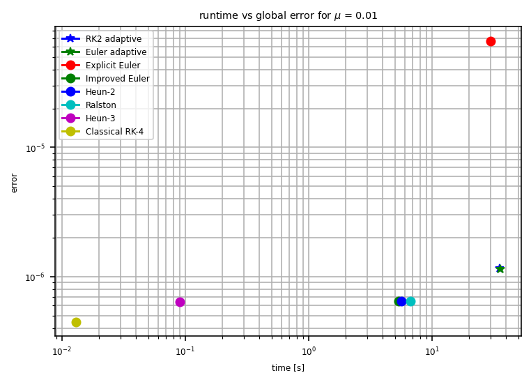
- Adaptive methods achieve high accuracy but with longer runtime
- RK4 is most efficient (0.01s runtime, 4.47e-7 error)
- All constant step methods perform well with moderate step counts, explicit euler is fastest but with least accuracy

### μ = 1 (Moderate Nonlinearity)

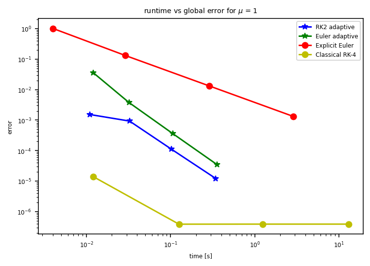
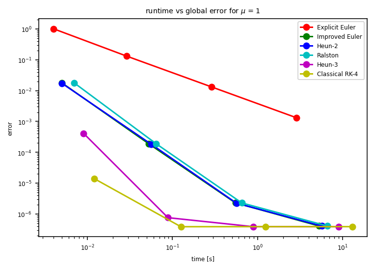
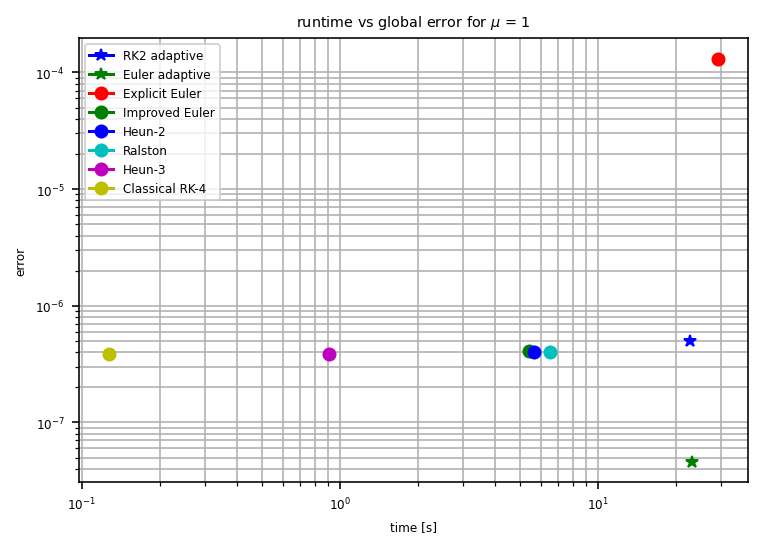
- Adaptive RK2 shows stable step size control
- RK4 maintains efficiency advantage
- Constant step methods require more steps for same accuracy

### μ = 15 (Strong Nonlinearity/Stiff)
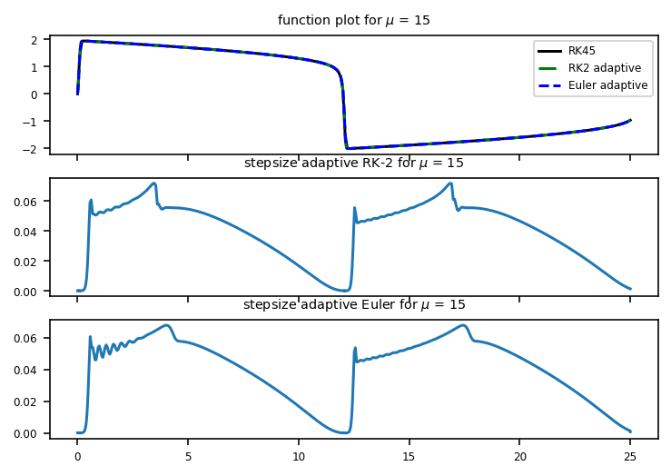
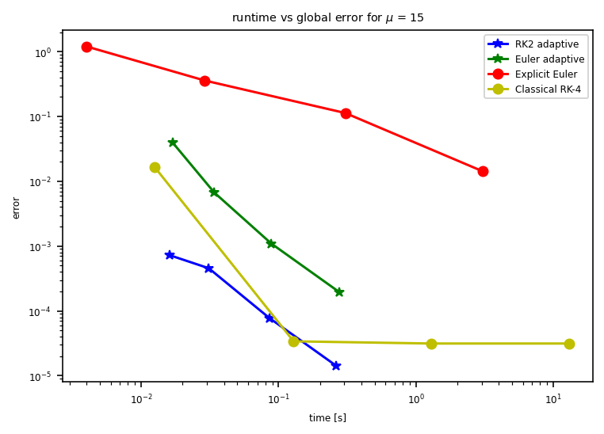

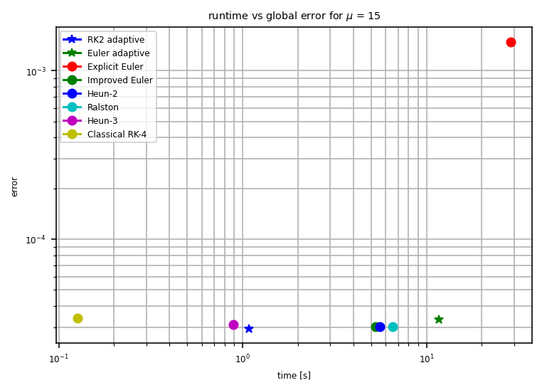
- RK2 adaptive is faster than Euler adaptive method (1.09s vs. 11.73s)
- Higher-order methods (RK4) maintain accuracy with fewer steps
- Explicit methods show stability challenges

## How to Reproduce

1. Clone repository:
```bash
git clone https://github.com/navidgolkar/Explicit_Method_ODE.git
cd Explicit_Method_ODE
